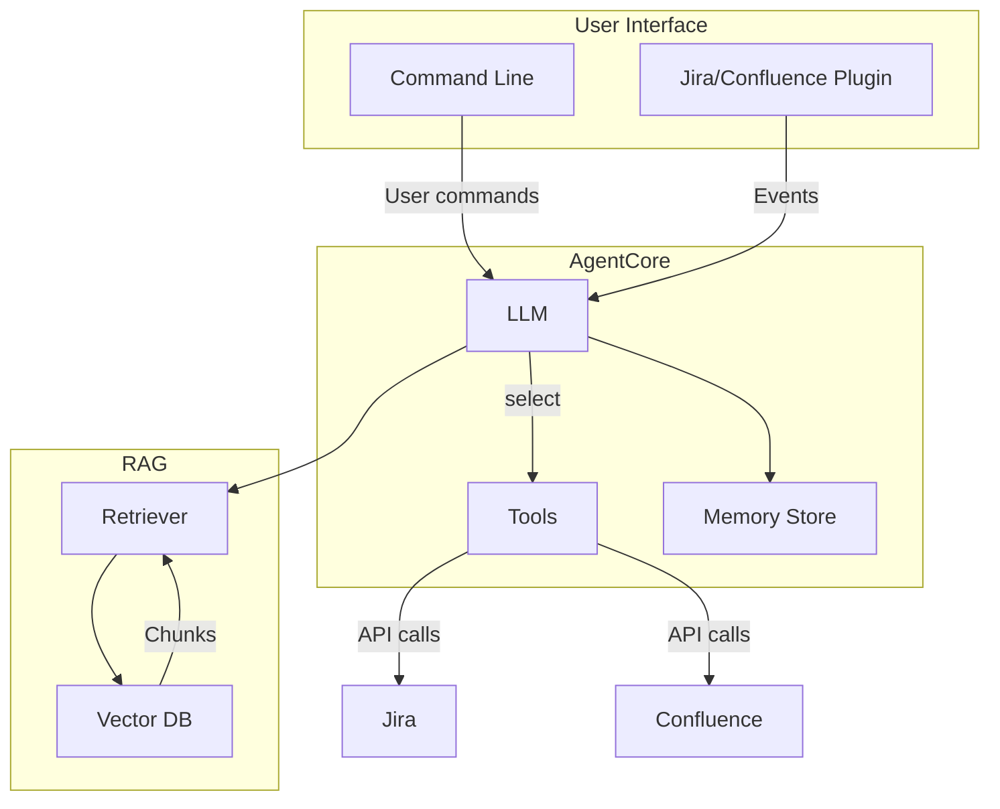

# Initial Architectural Blueprint

This document provides a high-level overview of the TicketSmith system architecture. It captures the core components and how data flows between them. The blueprint is a living design reference and should be kept up to date with the project's evolution.

## Overview Diagram

## Key Patterns

* **ReAct Loop** – The agent follows a Reason-Act loop (`Thought → Action → Observation`). The LLM reasons on current context, selects a tool, observes results, and repeats until the task is complete.
* **RAG Retrieval** – Knowledge base documents are chunked, embedded, and stored in a vector database. Queries are converted to vectors for similarity search and retrieved text is fed back into prompts.

## Security Model (Initial)

* **Authentication** – API tokens or OAuth for access to Jira, Confluence, and other services.
* **Authorization** – Least-privilege service accounts scoped via OAuth scopes or API permissions.
* **Data Handling** – Sensitive data is stored securely and only transiently sent to the LLM. PII is redacted before logging. Communications are encrypted in transit.

## Confluence Publication

The team should replicate this document in the project's Confluence space so stakeholders can comment and collaborate. Updates should be reflected in both locations.

