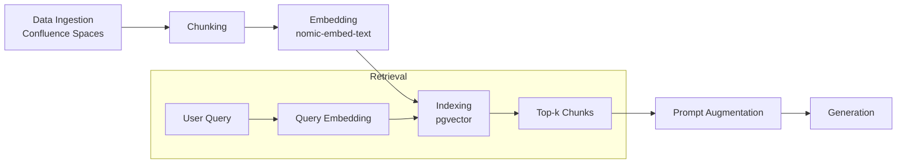

# Retrieval-Augmented Generation (RAG) Architecture

This document details how TicketSmith ingests knowledge sources and uses them at run time.

## Pipeline Diagram

## Data Sources

Content is pulled from the team's Confluence spaces such as **Engineering** and **Product**. Ingestion jobs may target additional spaces by configuration.

## Chunking Strategy

Documents are split with LangChain's `RecursiveCharacterTextSplitter` using a 1000 token size and 200 token overlap. This keeps related sentences together and improves recall.

## Embedding Model

The [`nomic-embed-text`](https://github.com/nomic-ai/nomic) model generates vector representations for each chunk. It offers a balance of quality and open licensing for self-hosted deployments.

## Vector Database

Embeddings and associated metadata are stored in PostgreSQL via the [`pgvector`](https://github.com/pgvector/pgvector) extension. This allows efficient similarity search without adding an extra service.

